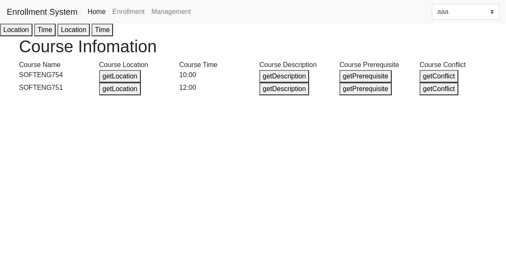

# SOFTENG754A4

Master Branch

# Instruction
  - Start backend: gradle bootRun
  - Start cucumber: gradle cucumber

## Technologies
  Frontend: Bootstrap, Element UI, JQuery
  
  Backend: Spring Boot
  
  Test: Cucumber, third-party html report, selenium

## Generated report
Generated html report is under `target/cucumber/cucumber-html-reports/`

## Web Service
Backend `/src/main/java/web/`

Frontend `src/main/resources/public`

## Features
`/src/test/resources/cucumber/`

## BDD Tests
`src/test/java/stepDefinitions/`

# Screen Shot
## Apply Concession

## Timetable

## Enrollment

## Course Info

## Course Management System

## Programme Requirement

